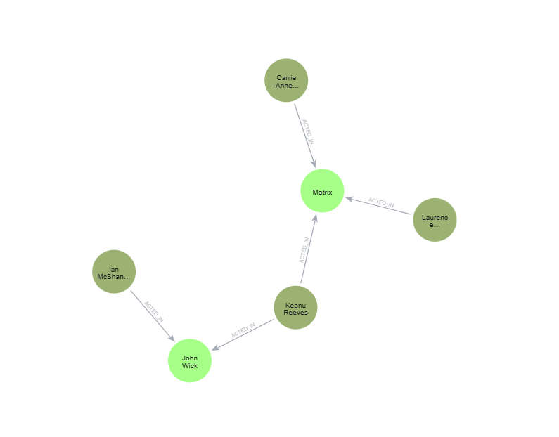

# 🎬 Neo4j Movie Graph

Projeto de modelagem de banco de dados em grafos utilizando Neo4j para representar relações entre atores e filmes.

---

## 📌 Sobre o Projeto

Este projeto demonstra, de forma prática, como utilizar o Neo4j para modelar e consultar dados altamente conectados.

O objetivo é representar a relação entre **atores e filmes**, permitindo consultas eficientes sobre conexões e participações.

---

## 🧠 Por que utilizar grafos?

Bancos de dados em grafos são ideais para cenários onde:

- Existem muitas relações entre dados
- Consultas dependem de conexões
- É necessário navegar entre entidades rapidamente

Diferente de bancos relacionais, o :contentReference[oaicite:1]{index=1} permite explorar relações de forma muito mais performática.

---

## 🏗 Modelo do Grafo

```
(:Actor)-[:ACTED_IN]->(:Movie)
```

### 📍 Entidades

**Actor**
- name

**Movie**
- title
- year

### 🔗 Relacionamento

**ACTED_IN**
- role

---

## 📊 Dataset

Os dados utilizados estão disponíveis em:

```
dataset/movies.csv
```

Contém informações sobre:
- atores
- filmes
- ano de lançamento
- papel desempenhado

---

## ⚙️ Como Executar

1. Instale o Neo4j Desktop  
2. Crie uma instância local  
3. Abra o Neo4j Browser  
4. Execute o script abaixo:

```cypher
CREATE (a1:Actor {name:"Keanu Reeves"})
CREATE (a2:Actor {name:"Laurence Fishburne"})
CREATE (a3:Actor {name:"Carrie-Anne Moss"})
CREATE (a4:Actor {name:"Ian McShane"})

CREATE (m1:Movie {title:"Matrix", year:1999})
CREATE (m2:Movie {title:"John Wick", year:2014})

CREATE (a1)-[:ACTED_IN {role:"Neo"}]->(m1)
CREATE (a2)-[:ACTED_IN {role:"Morpheus"}]->(m1)
CREATE (a3)-[:ACTED_IN {role:"Trinity"}]->(m1)

CREATE (a1)-[:ACTED_IN {role:"John Wick"}]->(m2)
CREATE (a4)-[:ACTED_IN {role:"Winston"}]->(m2)
```

---

## 🔍 Consultas de Negócio

### 🎭 Atores que participaram de um filme

```cypher
MATCH (a:Actor)-[:ACTED_IN]->(m:Movie {title:"Matrix"})
RETURN a
```

### 🎬 Filmes de um ator

```cypher
MATCH (a:Actor {name:"Keanu Reeves"})-[:ACTED_IN]->(m:Movie)
RETURN m
```

### 🔗 Visualizar o grafo completo

```cypher
MATCH (a:Actor)-[r:ACTED_IN]->(m:Movie)
RETURN a,r,m
```

---

## 📸 Visualizações

### 🧩 Modelo do Grafo


### 🌐 Relações entre atores e filmes



---

## 🛠 Tecnologias Utilizadas

- Neo4j
- Cypher
- CSV
- Modelagem de Grafos

---

## 🚧 Dificuldades Encontradas

- Restrição de acesso a arquivos CSV externos
- Diferenças na interface do Neo4j Desktop
- Configuração inicial do ambiente

---

## 💡 Aprendizados

- Modelagem de dados em grafos
- Uso da linguagem Cypher
- Criação e consulta de relacionamentos
- Visualização de dados conectados

---

## 👨‍💻 Autor

Theo Mischiatti Gomes

---

## ⭐ Considerações Finais

Este projeto demonstra de forma prática como grafos podem ser utilizados para representar e analisar dados conectados, sendo uma excelente alternativa para sistemas que envolvem relacionamentos complexos.
